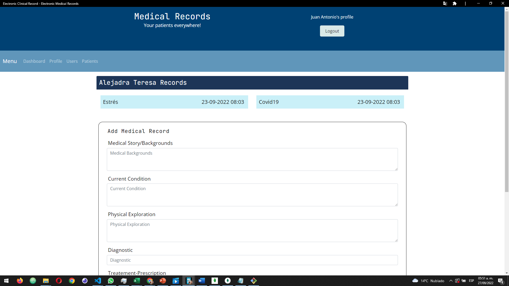

#  👓 Medical Records

## 📄 Description

This is a Full Stack Web App for Medical Records made wit MERN (MongoDB, Express, React and NodeJS). You can use it with PWA (Install it on Android, IOS, and other Operating Systems as an App). The fullstack App was deployed in Heroku.

## ⚙⚙ Web Page Functionality

The following image shows the Electronic Medical Record application's appearance:

You can get in into the App in the next link in Heroku [Medical Record](https://electronic-medical-record.herokuapp.com/) for testing.
